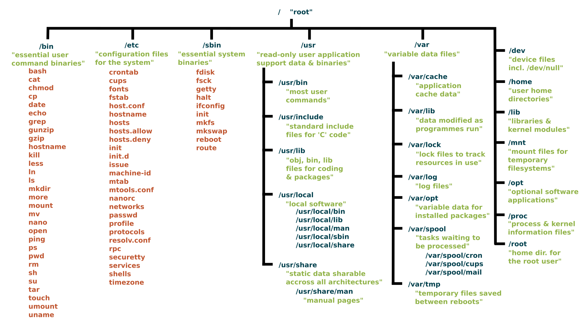

### *0x00 引言*
&ensp;&ensp;从终端窗口浏览Linux文件系统可以使用 tree 工具来显示Linux目录树的地图。
```sh
# tree使用方法
tree '文件夹路径'

# 只显示一级目录
# -L选项代表树显示的级数
tree -L 1 /
```

<div align=center>

<div align=left>  

### *0x01 目录结构*
```sh
1 /bin
2 /boot
3 /dev
4 /etc
5 /home
6 /lib
7 /media
8 /mnt
9 /opt
10 /proc
11 /root
12 /run
13 /sbin
14 /usr
15 /srv
16 /sys
17 /tmp
18 /var
```

***1. /bin***  
&ensp;&ensp;/bin 是包含二进制文件的目录，即可以运行的某些应用程序和程序。您将在此目录中找到上面提到的ls程序，以及用于创建和删除文件和目录，在文件中移动它们的其他基本工具，等等。文件系统树的其他部分中还有更多的 bin 目录，但稍后我们将讨论它们。  

***2. /boot***  
&ensp;&ensp;/boot 目录包含启动系统所需的文件。如果您弄乱了其中的一个文件，则可能无法运行Linux，并且很难修复。另一方面，必须具有超级用户权限才能执行此操作。

***3. /dev***  
&ensp;&ensp;/dev 包含设备文件,其中许多是在启动时甚至在运行时生成的。例如，如果您将新的网络摄像头或USB随身碟插入计算机，则会在此处自动弹出一个新的设备条目。

***4. /etc***  
&ensp;&ensp;/etc 包含大多数系统范围的配置文件。例如，包含系统名称，用户及其密码，网络上的计算机名称以及何时以及在何处安装硬盘上的分区的文件均位于此处。

***5. /home***  
&ensp;&ensp;/home 是存放用户个人目录的位置。

***6. /lib***  
&ensp;&ensp;/lib 是库所在的位置,库是包含应用程序可以使用的代码的文件。它们包含应用程序用来在桌面上绘制窗口，控制外围设备或将文件发送到硬盘的代码片段。

***7. /media***  
&ensp;&ensp;/media 目录用于自动挂载外部存储。

***8. /mnt***  
&ensp;&ensp;/mnt 目录,可以在此处手动安装存储设备或分区，它并不经常被使用。

***9. /opt***  
&ensp;&ensp;/opt 目录中编译软件,应用程序将最终在 /opt/bin 目录中，并将库文件存放在 /opt/lib 目录中。
注意：应用程序和库存放的另一个位置是 /usr/local ，在这里安装软件时，还将有 /usr/local/bin 和 /usr/local/lib 目录。开发人员如何配置用于控制编译和安装过程的文件，这决定了将哪种软件运往何处。

***10. /proc***  
&ensp;&ensp;/proc 就像 /dev 是一个虚拟目录，它包含有关您的计算机的信息。例如有关您的CPU和Linux系统正在运行的内核的信息。

***11. /root***  
&ensp;&ensp;/root 是系统超级用户的主目录，它与其他用户主目录分开。

***12. /run***  
&ensp;&ensp;/run 目录，系统进程使用它来存储临时数据，不要随意修改该文件。

***13. /sbin***  
&ensp;&ensp;/sbin 与 /bin 相似，但是 /sbin 包含仅超级用户所需的应用程序。/sbin 通常包含可以安装内容，删除内容和格式化内容的工具，需小心使用。

***14. /usr***  
&ensp;&ensp;/usr 目录是UNIX早期最初保留用户主目录的位置。现在，该目录包含应用程序、库文件、文档、壁纸、图表以及其他应用和服务共享的文件。  
&ensp;&ensp;/usr/bin、/usr/sbin、/usr/lib 目录内包含了用户安装的程序、库文件。

***15. /srv***  
&ensp;&ensp;/srv 目录包含了服务器数据。如果你在运行网页服务器，你的HTML文件会进入 /srv/http(或/srv/www)目录。如果你在运行FTP服务，你的文件会进入 /srv/ftp 目录。

***16. /sys***  
&ensp;&ensp;/sys 是一个虚拟目录(类似 /proc 和 /dev)，并且包含了远程连接设备的信息。  
&ensp;&ensp;比如可以通过修改文件 /sys/devices/pci0000:00/0000:00:02.0/drm/card1/card1-eDP-1/intel_backlight/brightness 改变屏幕亮度。不要轻易改动 /sys 目录。

***17. /tmp***  
&ensp;&ensp;/tmp 包含正在运行的应用程序生成的临时文件。文件和目录经常包含应用程序当前不需要但以后可能需要的数据。

***18. /var***  
&ensp;&ensp;/var 目录存放的是经常改变内容的文件，比如日志存放于 /var/log 。

### *0x02 常用目录*
```sh
# 已有的shell查看
cat /etc/shells

# 用户的配置文件
/etc/passwd:            # 用户的配置文件， 保存用户账户的基本信息
/etc/shadow             # 用户影子口令文件
/etc/group              # 用户组配置文件
/etc/gshadow            # 用户组的影子文件
/etc/default/useradd    # 使用useradd添加用户时需要调用的一个默认的配置文件
/etc/login.defs         # 定义创建用户时需要的一些用户的配置文件
/etc/skel/              # 存放新用户配置文件的目录
/etc/systemd/           # Linux下一种init软件 systemd的配置文件夹
/etc/lightdm/           # 轻量级 Linux 桌面显示管理器 lightdm的配置文件夹

# cmake存放.cmake文件的位置
/usr/share/'cmake-version'/Modules
```