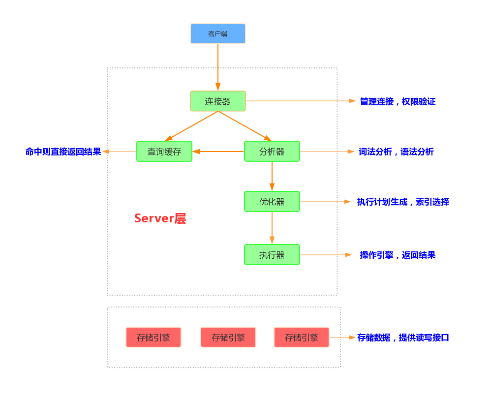
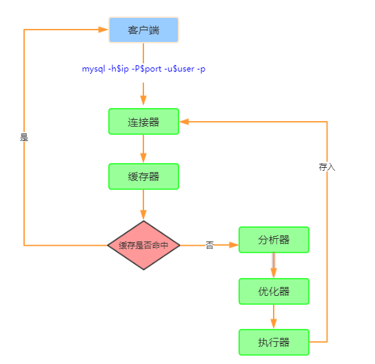
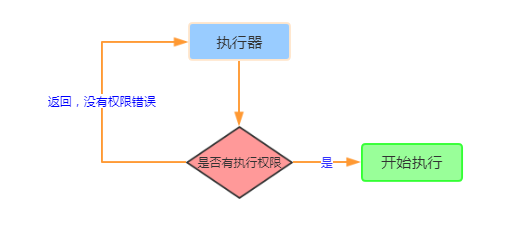
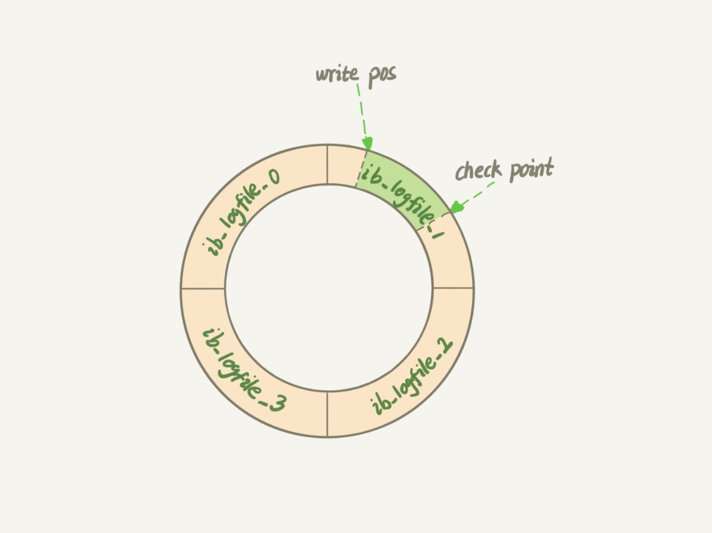
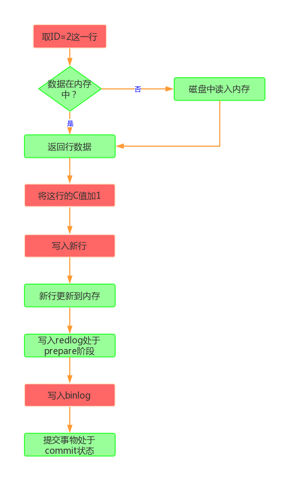
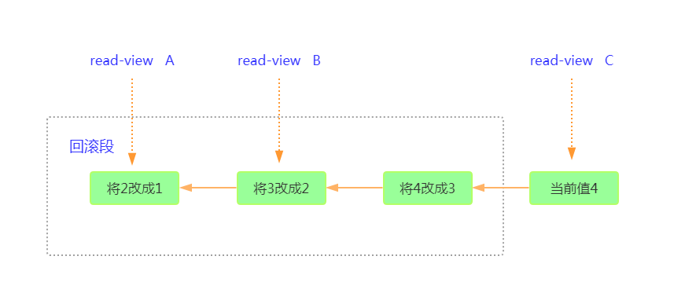

https://www.cnblogs.com/luoahong/p/10385466.html
https://time.geekbang.org/column/article/68963?utm_campaign=guanwang&utm_source=baidu-ad&utm_medium=ppzq-pc&utm_content=title&utm_term=baidu-ad-ppzq-title

# 0x01 基础架构
<div align=center>

<div align=left>  

<div align=center>

<div align=left>  


MySQL 可以分为 Server 层和存储引擎层两部分。  
Server 层包括连接器、查询缓存、分析器、优化器、执行器等，是共用的。  
存储引擎层负责数据的存储和提取，且是插件式的。支持 InnoDB、MyISAM、Memory 等多个存储引擎，现在最常用的存储引擎是 InnoDB。  

***连接器***  
定义: 接器负责跟客户端建立连接、获取权限、维持和管理连接。  
- 数据库里长连接是指连接成功后，如果客户端持续有请求，则一直使用同一个连接
- 短连接则是指每次执行完很少的几次查询就断开连接，下次查询再重新建立一个。

问题  
建立连接的过程通常是比较复杂的，所以应该尽量使用长连接。但长连接可能导致MySQL占用内存过快，因为 MySQL 在执行过程中临时使用的内存是管理在连接对象里面的。这些资源会在连接断开的时候才释放。  
解决方案  
1.定期断开长链接  2.MySQL5.7之后通过执行'mysql_reset_connection'来重新初始化连接资源

***查询缓存***  
之前执行过的语句及其结果可能会以 key-value 对的形式，被直接缓存在内存中。MySQL 拿到一个查询请求后，会先到查询缓存看看，之前是不是执行过这条语句。  
不建议使用查询缓存  
- 查询缓存的失效非常频繁，只要有一个表更新，这个表上所有的查询缓存都被清空
- 对于更新压力大的数据库来说，查询缓存的命中率会非常低，
- 除非你的业务就是有一张静态表，很长时间才会更新一次(比如一个系统配置表)

MySQL 8.0 版本开始直接将查询缓存的整块功能删掉

***分析器***  
执行sql语句前需要分析器先对用户的命令做‘词法分析’和‘语法分析’  
词法分析: 识别出里面的字符串分别是什么
语法分析: 判断输入的sql语句是否满足MySQL语法

***优化器***  
作用
- 在表里面有多个索引的时候，决定使用哪个索引
- 多表关联(ioin)的时候，决定各个表的链接顺序

***执行器***  
<div align=center>

<div align=left>  

# 0x02 日志系统
&emsp;&emsp;日志模块分为redo log与binlog。两种模块配合的方式称为WAL(Write-Ahead Logging)技术。

<div align=center>

<div align=left>

两种日志有以下区别
- redo log 是 InnoDB 引擎特有的；binlog 是 MySQL 的 Server 层实现的，所有引擎都可以使用。
- redo log 是物理日志，记录的是“在某个数据页上做了什么修改”；binlog 是逻辑日志，记录的是这个语句的原始逻辑，比如“给 ID=2 这一行的 c 字段加 1 ”。
- redo log 是循环写的，空间固定会用完；binlog 是可以追加写入的。“追加写”是指 binlog 文件写到一定大小后会切换到下一个，并不会覆盖以前的日志。

***redo log记录原理***  

<div align=center>

<div align=left>

&emsp;&emsp;redo log的内存空间是固定的。write pos与check point 之间是可写入部分，如果可写入空间不足，则清除一部分日志，并将check point后移。有了redo log，InnoDB就可以保证即使数据库发生异常重启，之前提交的记录都不会丢失，这个能力称为crash-safe

***update语句执行流程***  
&emsp;&emsp;update语句是比较典型的sql语句，能帮助我们理解日志记录的流程。

<div align=center>

<div align=left>

两段式提交  
&emsp;&emsp;图表中的最后三步，被称为"两段式提交"，其实就是:
```sh
1.写入redo log
2.写入binlog
3.commit
```

如何让数据库恢复到半个月内任意一秒的状态  
&emsp;&emsp;假如DBA承诺数据半个月内可以恢复，则意味着会保存半个月binlog(数据更改的逻辑记录)，同时系统会定期做整库备份(可以是一天一备，也可以一周一备)。当需要恢复到某一秒状态时:
```sh
1.找到最近的一次全量备份，从这个备份恢复到临时库
2.从备份的时间点开始，讲binlog依次取出，并回到目标时刻
```

# 0x03 事务隔离
&emsp;&emsp;所谓事务隔离，就是指两个sql指令之间，要对数据进性保护。  
***事务隔离的基础***  
1).事务基本要素（ACID）
- 原子性（Atomicity）：事务开始后所有操作，要么全部做完，要么全部不做，不可能停滞在中间环节。事务执行过程中出错，会回滚到事务开始前的状态，所有的操作就像没有发生一样。也就是说事务是一个不可分割的整体，就像化学中学过的原子，是物质构成的基本单位。
- 一致性（Consistency）：事务开始前和结束后，数据库的完整性约束没有被破坏 。比如A向B转账，不可能A扣了钱，B却没收到。
- 隔离性（Isolation）：同一时间，只允许一个事务请求同一数据，不同的事务之间彼此没有任何干扰。比如A正在从一张银行卡中取钱，在A取钱的过程结束前，B不能向这张卡转账。
- 持久性（Durability）：事务完成后，事务对数据库的所有更新将被保存到数据库，不能回滚。

2).事务的并发问题
- 脏读：事务A读取了事务B更新的数据，然后B回滚操作，那么A读取到的数据是脏数据
- 不可重复读：事务 A 多次读取同一数据，事务 B 在事务A多次读取的过程中，对数据作了更新并提交，导致事务A多次读取同一数据时，结果 不一致。
- 幻读：系统管理员A将数据库中所有学生的成绩从具体分数改为ABCDE等级，但是系统管理员B就在这个时候插入了一条具体分数的记录，当系统管理员A改结束后发现还有一条记录没有改过来，就好像发生了幻觉一样，这就叫幻读。

3).MySQL事务隔离级别

<div align=center>

<div align=left>

下面解释下四个事务隔离级别的意义:
- 读未提交: 一个事务还未提交，它的变更就能被别的事务看到
- 读提交: 一个事务提交后，它的变更才能被别的事务看到
- 可重复读: 一个事务执行过程中看到的数据，总是跟这个事务在启动时看到的数据是一致的。
- 串行化: 对于同一行记录，"写"会加"写锁"，"读"会加"读锁"。当出现读写锁冲突的时候，后访问的事务必须等前一个事务执行完成，才能继续执行

<div align=center>

<div align=left>

<div align=center>

<div align=left>

***事务隔离的实现***  
&emsp;&emsp;在 MySQL 中，每条记录在更新的时候都会同时记录一条回滚操作。同一条记录在系统中可以存在多个版本，这就是数据库的多版本并发控制（MVCC），也因此实现了事务隔离。当没有事务需要用到这些回滚日志的时候，回滚日志会被删除。

<div align=center>

<div align=left>

***事务的启动方式***  
1).尽量避免使用长事务  
&emsp;&emsp;长事务意味着系统里面会存在很老的read-view。由于这些事务随时可能访问数据库里面的任何数据，所以这个事务提交之前，数据库里面它可能用到的回滚记录都必须保留，这就会导致大量占用存储空间。

2).事务启动要注意的点
- set autocommit=0，这个命令会将这个线程的自动提交关掉。有些客户端连接框架会默认连接成功后先执行一个 set autocommit=0 的命令。这就导致接下来的查询都在事务中，如果是长连接，就导致了意外的长事务
- 显式启动事务语句， begin 或 start transaction。配套的提交语句是 commit，回滚语句是 rollback